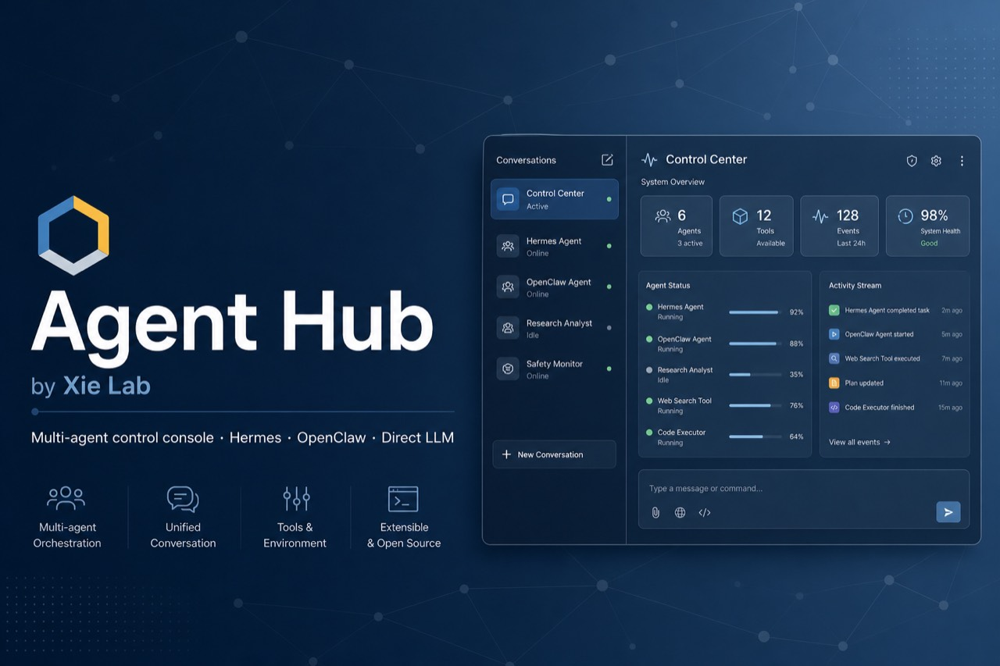
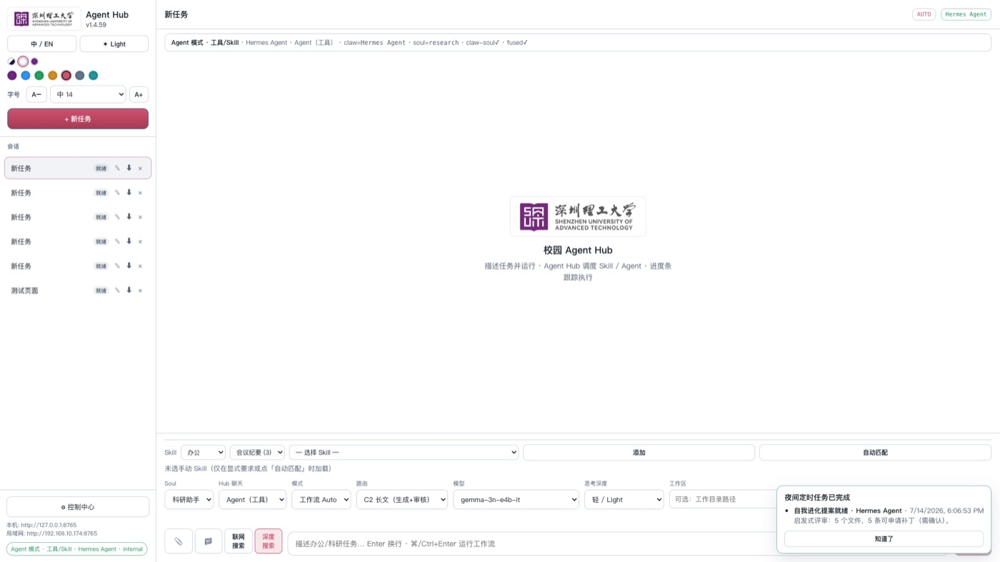
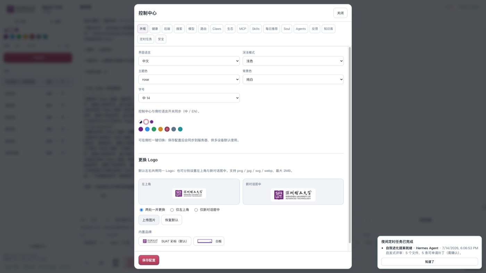

<p align="center">
  
</p>

<h1 align="center">Agent Hub</h1>

<p align="center">
  <strong>校园多 Agent 工作流控制台</strong><br/>
  统一调度 Hermes / OpenClaw / NanoBot / Direct LLM · Soul · Skills · MCP · 并行子代理
</p>

<p align="center">
  <a href="https://github.com/xielab2017/Agent-Hub/releases"></a>
  <a href="LICENSE"></a>
  <a href="https://www.python.org/"></a>
  <a href="https://github.com/xielab2017/Agent-Hub"></a>
</p>

<p align="center">
  
</p>

---

## 这是什么

**Agent Hub** 是一个本地 Web 控制台：浏览器只做 UI，真正的网关跑在本机进程里。  
它连接各 Claw 的**原生 home**（`~/.hermes` · `~/.openclaw` · `~/.nanobot`），而不是再造一份平行 Agent。

| 能力 | 说明 |
|------|------|
| **Agent / 快聊** | Agent 模式走 Hermes 工具链；Direct 适合问候与快速对话 |
| **分层路由 C0–C3** | 简单 / 办公 / 长文生成+审核 / 推理 / Vision，可绑定不同模型 |
| **并行子代理** | 自然语言或点选多 Slot，看板并行 + 合成 |
| **Soul / Skills / MCP** | 多身份、技能库、MCP Hub |
| **控制中心** | 模型、路由、生态、外观 Logo、定时任务、自我进化等 |
| **Hermes 深度会话** | 一键启动/嵌入 [Hermes-WebUI](https://github.com/nesquena/hermes-webui)，共享 `HERMES_HOME` 与 C0–C3 路由契约 |
| **跨设备** | 默认监听 `0.0.0.0:8765`，同局域网可用 IP 访问 |

<p align="center">
  
  <br/><em>主界面 · v3.0.0</em>
</p>

<p align="center">
  
  <br/><em>控制中心 · 外观 / 内置品牌 Logo</em>
</p>

---

## 快速开始

### 要求

- Python **3.9+**
- 可选：已安装的 [Hermes Agent](https://github.com/NousResearch/hermes-agent) / OpenClaw 等（控制中心可检测）

### macOS（推荐：后台守护）

1. 克隆并进入仓库：

```bash
git clone https://github.com/xielab2017/Agent-Hub.git
cd Agent-Hub
chmod +x ctl.sh "Start Agent Hub.command" start.sh
```

2. 双击 **`Start Agent Hub.command`**，或：

```bash
./ctl.sh start
./ctl.sh open
```

浏览器：<http://127.0.0.1:8765>

> 关闭浏览器 / Terminal **不会**停止网关。显式停止：`./ctl.sh stop`。

可选（开机自启 + 崩溃自动拉起）：

```bash
./ctl.sh install-service
./ctl.sh status   # logs | stop | restart | uninstall-service
```

> **提示（macOS）**：若仓库放在 `Documents` / `Desktop` / `Downloads`，系统 TCC 可能限制 launchd 直读 `server.py`。更稳的做法是把仓库放到例如 `~/Projects/Agent-Hub` 后再 `./ctl.sh install-service`。这不影响代码本身与其他平台。

### Windows

```bat
git clone https://github.com/xielab2017/Agent-Hub.git
cd Agent-Hub
start-agent-hub.bat
```

或 PowerShell：`.\start.ps1`

### Linux / 通用命令行

```bash
./ctl.sh start
# 前台调试：
python3 server.py --host 0.0.0.0 --port 8765
```

可选环境变量：

| 变量 | 含义 |
|------|------|
| `HERMES_ALI_HOST` | 绑定地址（默认 `0.0.0.0`） |
| `HERMES_ALI_PORT` | 端口（默认 `8765`） |
| `HERMES_ALI_PASSWORD` | 可选访问密码 |
| `HERMES_ALI_STATE_DIR` | 覆盖 Hub 状态目录 |
| `HERMES_HOME` | Hermes 原生 home |

---

## 数据与配置目录

| 路径 | 用途 |
|------|------|
| macOS/Linux：`~/.hermes/ali/` | Hub 状态、会话、日志、自定义 Logo |
| Windows：`%LOCALAPPDATA%\hermes-ali\` | 同上 |
| `~/.hermes/` · `~/.openclaw/` · … | 各 Claw **原生**配置（不受 Hub 克隆路径影响） |
| 密钥 | 存于 Hub 状态目录 `secrets.json`（权限收紧），**勿提交 Git** |

示例校园配置模板：[`assets/campus-office-ai.example.json`](assets/campus-office-ai.example.json)

---

## 功能速览

### Soul（多身份）

控制中心 → **Soul**：内置 / 自建角色；同步到 claw home 并注入系统提示。主界面底部可按任务切换。

### Skills

按分类选择；「自动匹配」可按任务推断。管理与安装见控制中心 **Skills**。

### 路由与模型

- **工作流 Auto**：按任务复杂度选 C0/C1/C2/C3
- **指定模型**：固定单一模型
- 多提供商目录（DeepSeek、OpenAI 兼容、NVIDIA NIM、OpenRouter 等）

### 并行子代理

自然语言如「分成三个子代理」，或 Agents 里多选 Slot；看板分车道运行，完成后合成。

### 外观

中英、浅/深色、主题色；Logo 可上传或选内置品牌（SUAT 彩标 / 白板）。

---

## 仓库结构

```
Agent-Hub/
├── server.py              # HTTP 网关入口
├── bootstrap.py           # 引导 / 依赖检查
├── ctl.sh                 # start/stop/status/install-service
├── Start Agent Hub.command  # macOS 一键后台启动
├── start-agent-hub.bat    # Windows 一键后台启动
├── start.sh / start.ps1
├── ali/                   # 业务逻辑（路由、流式、Agent、Soul…）
├── static/                # Web UI（HTML/CSS/JS）+ brand 资源
├── assets/                # 示例配置
├── docs/images/           # README 配图
└── pyproject.toml
```

---

## 开发与版本

当前版本：**v3.0.0**（分支 `v3.0`）

```bash
# 健康检查
curl -s http://127.0.0.1:8765/api/health

# 检出 V3.0 分支
git fetch origin
git checkout v3.0
```

简要更新：

- **v3.0.0** — 与 Hermes-WebUI 深度融合：一键联运 / iframe 深度会话、共享 `HERMES_HOME`、导出 C0–C3 路由契约
- **v2.0.0** — 统一模型目录、路由与 Agent/Subagent 选模；自适应可调布局；代理 TLS 配置持久化
- **v1.4.59** — 内置 Logo 预设：SUAT 彩标 + 白板；Hub 守护安装加固  
- **v1.4.58** — 子代理对接 C0–C3 + Soul；并行自动选档位  
- **v1.4.57** — 并行任务切换与进度条修复  
- **v1.4.56** — Appearance 可更换左侧/新对话 Logo  

更早版本见 [`CHANGELOG.md`](CHANGELOG.md)。

---

## GitHub 上的使用方式

本仓库路径无关、跨平台：

```bash
git clone https://github.com/xielab2017/Agent-Hub.git
cd Agent-Hub
./ctl.sh start   # 或对应平台脚本
```

- **上传 / 协作**：照常 `git push` 到本仓库；**不要**提交 `.env`、真实 API Key、本机绝对路径。  
- **旧名 Hermes-ALI**：历史代码曾用该名；当前产品与主仓为 **Agent Hub**（本仓库）。  
- **Release**：打 tag `v*` 可触发 [Release workflow](.github/workflows/release.yml) 打包源码归档。

---

## 许可

[MIT](LICENSE) © Xie Lab / [xielab2017](https://github.com/xielab2017)

---

<p align="center">
  <sub>深圳理工大学 · Campus Agent Hub</sub>
</p>
