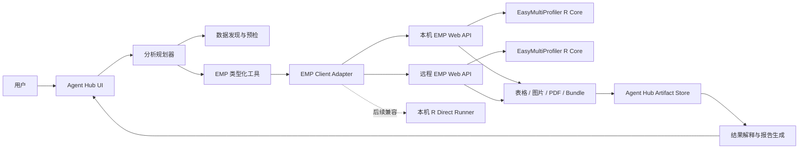

# Agent Hub x EasyMultiProfiler 联合分析实施方案

> 文档状态：Phase 1 implemented
> 文档版本：v1.0  
> 更新日期：2026-07-19  
> 目标版本：Agent Hub v5.x / EasyMultiProfiler Web v7.x  
> 适用仓库：`Agent-Hub`、`EasyMultiProfiler-Web`

## 1. 文档目的

本方案用于指导 Agent Hub 与 EasyMultiProfiler（以下简称 EMP）建立统一的多组学联合分析能力。完成后，用户可以在 Agent Hub 中选择或输入本地数据目录，用自然语言描述研究问题，由 Agent Hub 完成数据发现、分析规划、参数确认、任务调度、进度跟踪、结果汇总和研究解释，EMP 负责实际的 R 计算、统计分析和可视化。

本文档可以直接交给开发团队、Cursor、Codex 或其他编码 Agent 执行。除非任务明确扩大范围，实施过程应遵循本文定义的接口、安全边界和阶段顺序。

## 2. 背景与现状

### 2.1 Agent Hub 已有能力

- 本地工作区配置和目录选择。
- 会话、文件夹、上传文件及上传目录。
- Agent、Direct LLM、并行子代理和工作流编排。
- MCP、Skills、审计和权限确认机制。
- 工作区快照、上下文注入及结果写入能力。

当前不足：

- 工作区选择器主要浏览目录，缺少面向组学数据的文件发现和预览。
- 没有 EMP 客户端、EMP session 映射和任务状态模型。
- LLM 目前没有一组受约束、可审计的 EMP 工具。
- 尚不能将 EMP 的表格、图片、PDF 和 bundle 作为会话产物管理。

### 2.2 EMP 已有能力

- Plumber REST API，默认地址为 `http://127.0.0.1:8000`。
- 独立静态 Web 前端，默认地址为 `http://127.0.0.1:8080`。
- Session 创建、数据导入、实验列表和多组学工作流目录。
- 16S、转录组、代谢组、宏基因组、ChIP-seq、Clinical 等工作流。
- 同步及异步分析、`job_id` 轮询和结果获取。
- 图表、PDF、RDS/EMPT 和结果 bundle 导出。
- ChIP-seq 已有服务器端 BAM 路径注册和目录扫描，可作为通用路径导入的参考。

当前不足：

- 通用矩阵导入主要面向 multipart 上传，缺少受控的服务器本地路径导入接口。
- EMP session 默认位于 `/tmp/emp_sessions`，重启后可能丢失。
- 本地教学部署与远程部署的认证和数据隔离能力不同。
- API 能力较多，但还没有面向外部 Agent 的稳定能力清单和版本协商机制。

## 3. 产品目标

### 3.1 核心目标

用户可以在 Agent Hub 中完成以下流程：

1. 选择一个本地数据目录或上传数据文件。
2. 让系统识别数据类型、矩阵方向、metadata、taxonomy 和候选分组变量。
3. 用自然语言提出分析目标。
4. 查看并确认结构化分析计划。
5. 调用本地或远程 EMP 执行分析。
6. 在 Agent Hub 中查看进度、错误和中间结果。
7. 获取表格、图表、PDF、bundle 和中文/英文结果解释。
8. 保存完整的参数、软件版本、输入摘要和产物清单以便复现。

### 3.2 典型用户故事

#### 用户故事 A：本机 16S 分析

> 分析 `/Users/name/project/16s/data`，将 `meta.csv` 中的 `Group` 作为分组，完成质控、Alpha 多样性和组间差异分析，生成中文报告。

预期行为：Agent Hub 扫描目录、识别丰度表和 metadata、预览样本匹配情况、生成计划；用户确认后，系统调用本机 EMP API，跟踪任务并返回结果。

#### 用户故事 B：远程 EMP 分析

> 把当前工作区里的 RNA-seq counts 和 mapping 上传到实验室 EMP 服务器，运行差异分析和 GSEA。

预期行为：Agent Hub 明确提示数据将离开本机；用户批准后，通过 multipart 或分块上传传输文件，调用远程 EMP，并将结果下载回当前工作区。

#### 用户故事 C：多组学联合分析

> 联合分析同一批样本的转录组和微生物组数据，先分别完成差异分析，再寻找共同临床变量相关的信号。

预期行为：Agent Hub 创建多个 EMP experiment 或关联 session，分别执行标准流程，再由联合分析工作流或解释代理汇总结果。每个结论必须能够追溯到具体表格、图形和参数。

## 4. 非目标

第一阶段不包含以下内容：

- 在 Agent Hub 中重写 EMP 的统计分析算法。
- 将完整 EMP Web UI 嵌入 Agent Hub iframe。
- 允许 LLM 生成并直接执行任意 R 代码。
- 自动决定高风险或科学上关键的分组、协变量和统计阈值。
- 第一阶段直接支持公网匿名多用户部署。
- 自动上传受限数据到远程服务而不经过用户确认。

## 5. 总体架构



### 5.1 责任边界

Agent Hub 负责：

- 数据目录选择、文件发现和数据配对建议。
- 自然语言到结构化分析计划的转换。
- 用户确认、权限控制、审计和运行记录。
- EMP 服务发现、API 调用、重试、轮询和错误翻译。
- 结果产物登记、展示、联合解释和报告生成。

EMP 负责：

- 数据导入、格式转换和组学对象构建。
- 统计分析、工作流执行和绘图。
- Session、experiment、job 和 bundle 的生命周期。
- 参数校验及科学计算错误的明确返回。
- 分析结果的机器可读输出和下载接口。

## 6. 运行模式

### 6.1 `local-api`：本机 EMP Web API

这是默认和优先实现的模式。

- Agent Hub 与 EMP 在同一台电脑运行。
- EMP API 默认：`http://127.0.0.1:8000`。
- 小文件可以继续使用 multipart 上传。
- 大文件可通过受控路径导入，避免浏览器复制和内存开销。
- 数据默认不离开本机。

### 6.2 `remote-api`：远程 EMP Web API

- Agent Hub 调用实验室服务器或云端 EMP。
- 客户端绝对路径对远程服务器没有意义，必须上传文件或使用双方都能访问的共享存储 URI。
- 上传前必须展示目标服务、文件数量、总大小和数据策略，并要求确认。
- 服务端必须提供认证、用户隔离、配额和持久化存储。

### 6.3 `r-direct`：本机 R 包直调

该模式作为第二阶段以后可选能力：

- 适用于不启动 EMP Web 服务的离线环境。
- 通过固定的 R runner 和 JSON 输入输出调用已审核函数。
- 不允许把自由文本直接拼接为 R 代码。
- 输出结构应与 EMP Web Adapter 统一。

### 6.4 自动选择策略

建议 `mode=auto` 时按以下顺序选择：

1. 检查配置的本机 EMP API 健康状态和版本兼容性。
2. 本机可用时选择 `local-api`。
3. 本机不可用且配置了远程服务时，提示远程上传策略并等待确认。
4. 已明确启用 `r-direct` 且本机 R 环境通过检测时，可作为最后回退。
5. 都不可用时返回可操作的启动或安装提示，不自动安装大型 R 依赖。

## 7. 建议配置

在 Agent Hub 配置中增加：

```json
{
  "emp": {
    "enabled": true,
    "mode": "auto",
    "local_api_base": "http://127.0.0.1:8000",
    "remote_api_base": "",
    "api_token_env": "EMP_API_TOKEN",
    "request_timeout_seconds": 60,
    "job_timeout_minutes": 120,
    "poll_interval_seconds": 2,
    "allowed_roots": [],
    "artifact_root": "",
    "remote_upload_limit_mb": 2048,
    "allow_r_direct": false,
    "require_remote_upload_approval": true
  }
}
```

配置规则：

- API token 只保存环境变量名，真实 token 存入 Agent Hub secrets。
- `allowed_roots` 为空时，默认只允许当前 Agent Hub workspace 和会话上传目录。
- `artifact_root` 为空时使用 Agent Hub 状态目录下的 session artifact 目录。
- 远程地址必须明确配置，不根据聊天文本临时接受任意 URL。

## 8. 数据发现与预检

### 8.1 工作区扫描

Agent Hub 增加只读数据扫描能力，返回：

- 文件名、相对路径、大小、修改时间和扩展名。
- CSV/TSV/TXT 的分隔符、行列数估计、前若干行预览。
- 候选数据角色：`assay`、`metadata`、`taxonomy`、`mapping`、`clinical`、`bam`、`peak`。
- 候选组学类型：`microbiome_16s`、`transcriptomics`、`metabolomics`、`metagenomics`、`chipseq`、`clinical`。
- 样本位于行还是列的推断。
- 数据表与 metadata 的样本 ID 交集、缺失和重复情况。
- 文件 checksum，建议至少记录 SHA-256；超大文件可按配置延迟计算。

扫描必须遵守以下限制：

- 默认最多扫描两级目录，用户可明确扩大范围。
- 默认不读取隐藏目录、Git 目录、环境目录和密钥类文件。
- 预览只读取有限字节和有限行。
- 不因扫描而修改、移动或重命名原始文件。

### 8.2 数据清单结构

建议统一生成 `DatasetManifest`：

```json
{
  "manifest_version": "1.0",
  "workspace": "/absolute/project/path",
  "omics_type": "microbiome_16s",
  "experiment_name": "study_16s",
  "files": [
    {
      "role": "assay",
      "path": "data/abundance.csv",
      "size": 123456,
      "sha256": "..."
    },
    {
      "role": "metadata",
      "path": "data/meta.csv",
      "size": 2345,
      "sha256": "..."
    }
  ],
  "orientation": "features_in_rows",
  "sample_id_column": "SampleID",
  "sample_overlap": {
    "assay": 24,
    "metadata": 24,
    "matched": 24
  },
  "warnings": []
}
```

所有路径在持久化时优先保存为 workspace 相对路径，同时记录运行时解析出的绝对路径。发送给远程 EMP 时不得发送无意义的客户端绝对路径。

## 9. 分析计划模型

自然语言不能直接转换成任意 API 请求。Agent Hub 应先生成并校验 `AnalysisPlan`：

```json
{
  "plan_version": "1.0",
  "title": "16S group comparison",
  "dataset_manifest_id": "manifest-...",
  "emp_mode": "local-api",
  "workflow": "microbiome_16s",
  "experiment_name": "study_16s",
  "steps": [
    {
      "id": "validate",
      "tool": "emp.workflow.validate",
      "params": {}
    },
    {
      "id": "taxonomy_prepare",
      "tool": "emp.prepare.taxonomy",
      "depends_on": ["validate"],
      "params": {"level": "Genus"}
    },
    {
      "id": "alpha",
      "tool": "emp.analyze.alpha",
      "depends_on": ["taxonomy_prepare"],
      "params": {"group_var": "Group"}
    },
    {
      "id": "differential",
      "tool": "emp.analyze.differential",
      "depends_on": ["taxonomy_prepare"],
      "params": {
        "group_var": "Group",
        "method": "auto",
        "comparison_mode": "pairwise"
      }
    }
  ],
  "output": {
    "language": "zh",
    "include_tables": true,
    "include_plots": true,
    "include_bundle": true,
    "generate_report": true
  },
  "requires_confirmation": true
}
```

计划校验至少包括：

- 工作流是否由 EMP 当前版本支持。
- 每一步的工具名和参数是否存在于本地 schema。
- 依赖关系是否无环。
- 分组变量是否真实存在。
- 分组水平和样本量是否满足最低要求。
- 分析方法是否适用于数据类型。
- 是否涉及远程上传、覆盖文件或高成本运行。

## 10. EMP API 扩展建议

### 10.1 能力与版本协商

新增：

```http
GET /api/capabilities
```

建议响应：

```json
{
  "success": true,
  "api_version": "1.0",
  "emp_version": "7.0.0",
  "features": {
    "path_import": true,
    "async_jobs": true,
    "bundles": true,
    "persistent_sessions": true
  },
  "workflows": ["microbiome_16s", "transcriptomics"],
  "limits": {
    "max_upload_bytes": 2147483648
  }
}
```

Agent Hub 启动或首次调用时缓存该响应。若能力缺失，应隐藏相应工具或采用明确的兼容路径。

### 10.2 通用本地路径预检

新增：

```http
POST /api/import/path/preview
Content-Type: application/json
```

请求：

```json
{
  "data_path": "/allowed/project/abundance.csv",
  "metadata_path": "/allowed/project/meta.csv",
  "data_type": "tax"
}
```

响应只提供预检，不创建实验：

```json
{
  "success": true,
  "data": {
    "rows": 1200,
    "columns": 25,
    "orientation": "features_in_rows"
  },
  "metadata": {
    "rows": 24,
    "sample_id_column": "SampleID"
  },
  "sample_overlap": 24,
  "warnings": []
}
```

### 10.3 通用本地路径导入

新增：

```http
POST /api/import/path
Content-Type: application/json
```

请求字段应尽量与现有 `/api/import` 一致：

```json
{
  "session_id": null,
  "data_path": "/allowed/project/abundance.csv",
  "metadata_path": "/allowed/project/meta.csv",
  "experiment_name": "study_16s",
  "data_type": "tax",
  "assay_name": "counts",
  "start_level": "Species",
  "tax_sep": ";"
}
```

服务端要求：

- 对路径执行 `normalizePath(..., mustWork=TRUE)`。
- 仅允许位于 `EMP_ALLOWED_ROOTS` 中的文件。
- 拒绝符号链接逃逸、目录遍历和设备文件。
- 记录输入路径、大小、mtime 和 checksum。
- 复用现有 `build_mae()` / `add_experiment_to_mae()`，不要复制导入逻辑。
- 返回结构与现有 `/api/import` 保持一致。

### 10.4 项目与持久化 Session

新增或扩展：

```http
POST /api/projects
GET /api/projects/<project_id>
POST /api/projects/<project_id>/sessions
GET /api/session/<session_id>/manifest
```

建议将 session 根目录从硬编码 `/tmp/emp_sessions` 改为：

```text
EMP_SESSION_DIR 环境变量
  -> 未配置时使用平台用户数据目录
  -> 测试环境可继续使用临时目录
```

Manifest 至少记录：

- EMP、R 和关键 R 包版本。
- 输入文件摘要和 checksum。
- experiment 及数据类型。
- 执行过的步骤、参数、时间和状态。
- 结果文件相对路径及 MIME 类型。
- 失败信息和重试历史。

### 10.5 任务取消

建议新增：

```http
POST /api/jobs/<job_id>/cancel
```

取消结果应区分 `cancel_requested`、`cancelled`、`already_finished` 和 `not_cancellable`。

## 11. Agent Hub 适配层设计

### 11.1 建议新增文件

```text
ali/emp_client.py          # HTTP client、健康检查、重试、轮询、下载
ali/emp_models.py          # DatasetManifest、AnalysisPlan、Job、Artifact
ali/emp_discovery.py       # 文件扫描、预览、角色推断和样本匹配
ali/emp_service.py         # 业务编排、session 映射和运行记录
ali/emp_tools.py           # 暴露给 Agent/Hermes 的类型化工具
tests/test_emp_client.py
tests/test_emp_discovery.py
tests/test_emp_service.py
```

在 `ali/routes.py` 中只增加薄路由，复杂逻辑放入上述模块。

### 11.2 EMP Client 接口

建议 Python 接口：

```python
class EmpClient:
    def health(self) -> dict: ...
    def capabilities(self) -> dict: ...
    def create_session(self) -> str: ...
    def import_upload(self, manifest: dict, session_id: str | None = None) -> dict: ...
    def import_path(self, manifest: dict, session_id: str | None = None) -> dict: ...
    def list_experiments(self, session_id: str) -> list[dict]: ...
    def run_step(self, tool: str, params: dict) -> dict: ...
    def get_job(self, job_id: str) -> dict: ...
    def get_job_result(self, job_id: str) -> dict: ...
    def cancel_job(self, job_id: str) -> dict: ...
    def list_bundles(self, session_id: str) -> list[dict]: ...
    def download_artifact(self, url: str, destination: Path) -> Path: ...
```

Client 要求：

- 统一处理连接失败、超时、HTTP 错误和 EMP 业务错误。
- GET 可有限重试；创建 session、导入和启动分析默认不盲目重试。
- 使用幂等键或先查询运行状态，避免重复提交昂贵任务。
- 日志不得包含 API token、完整敏感 metadata 或未经处理的远程响应。
- 所有下载文件必须校验文件名、大小和目标目录。

### 11.3 Agent 工具清单

第一阶段仅暴露以下类型化工具：

```text
emp.status
emp.dataset.scan
emp.dataset.preview
emp.session.create
emp.dataset.import
emp.workflow.list
emp.workflow.validate
emp.analysis.plan
emp.analysis.run
emp.job.status
emp.job.cancel
emp.result.list
emp.result.download
emp.report.generate
```

工具原则：

- Agent 只能调用注册工具，不直接构造任意 EMP URL。
- 参数使用 JSON Schema 校验。
- `dataset.import` 在远程模式下触发 `external_upload` 审批。
- `analysis.run` 必须引用已确认或符合自动执行政策的 `AnalysisPlan`。
- 文件删除、覆盖和远程上传沿用 Agent Hub 现有审批策略。

## 12. Session 与任务映射

Agent Hub session 和 EMP session 不是同一概念，应显式映射：

```json
{
  "agent_hub_session_id": "hub-session-...",
  "emp_endpoint_id": "local-default",
  "emp_project_id": "optional-project-id",
  "emp_session_id": "EMP24CHARSESSIONID",
  "dataset_manifest_id": "manifest-...",
  "analysis_plan_id": "plan-...",
  "created_at": "2026-07-19T10:00:00+08:00",
  "last_seen_at": "2026-07-19T10:20:00+08:00"
}
```

要求：

- 一个 Agent Hub session 可以关联多个 EMP session。
- endpoint、session 和 manifest 必须绑定，避免把本机 session ID 发送到远程 EMP。
- Agent Hub 重启后应恢复映射并重新查询未完成任务。
- EMP session 不存在时，不自动静默重建；应提示用户选择重新导入或恢复项目。

## 13. 结果与产物管理

建议统一 `Artifact`：

```json
{
  "artifact_id": "artifact-...",
  "kind": "plot",
  "name": "alpha_diversity.pdf",
  "mime_type": "application/pdf",
  "source": "emp",
  "emp_session_id": "...",
  "job_id": "...",
  "analysis_step_id": "alpha",
  "local_path": "artifacts/alpha_diversity.pdf",
  "sha256": "...",
  "size": 456789,
  "created_at": "..."
}
```

目录建议：

```text
<Agent Hub state>/emp/
  manifests/
  plans/
  mappings/
  jobs/
  artifacts/<hub-session-id>/<run-id>/
  reports/<hub-session-id>/<run-id>/
```

报告生成要求：

- 将“计算结果”和“LLM 解释”分开保存。
- 每个主要结论引用来源 artifact、表格列或图形。
- 明确记录统计方法、多重检验方法和阈值。
- 不把相关性描述为因果关系。
- 数据不足或模型假设不满足时，在结论前展示警告。

## 14. 用户界面建议

第一阶段保持界面克制，只增加完成工作流所需入口：

### 14.1 工作区区域

- 增加“扫描组学数据”命令。
- 显示识别出的数据集、文件角色和匹配状态。
- 对冲突或不确定配对提供下拉选择。

### 14.2 分析计划确认

- 显示工作流、输入文件、分组变量、比较组、方法、预计输出和运行位置。
- 本地运行显示“数据保留在本机”。
- 远程运行显示服务地址、上传文件数和总大小。
- 科学关键参数必须显式可编辑。

### 14.3 运行状态

- 使用稳定尺寸的步骤列表展示 `pending/running/done/error/cancelled`。
- 显示 EMP 返回的真实进度和消息。
- 提供取消和查看日志命令。
- Agent Hub 页面刷新后可恢复状态。

### 14.4 结果区域

- 表格、图片、PDF 和 bundle 分类型展示。
- 支持打开 EMP Web 对应 session 或项目，但不依赖 iframe。
- 支持将结果加入当前对话上下文并生成联合解释。

## 15. 安全与隐私要求

### 15.1 本地路径

- 所有路径先规范化，再检查是否位于允许根目录。
- 防止 `..`、符号链接和大小写差异导致目录逃逸。
- 默认只读原始输入；结果写入独立 artifact 目录。
- 不允许聊天内容直接扩大 `allowed_roots`。

### 15.2 远程上传

- 远程上传属于外部数据传输，必须遵循 `data_policy`。
- `restricted` 数据默认禁止远程上传，除非管理员策略明确允许。
- 上传前要求用户确认，确认信息包含目标、文件和大小。
- 支持 TLS；生产环境拒绝明文 HTTP 远程地址。
- API token 存入 secrets，不进入日志、会话正文或分析 manifest。

### 15.3 EMP 服务

- 本机模式默认只监听 `127.0.0.1`。
- 远程部署不能使用 `Access-Control-Allow-Origin: *`。
- 远程部署必须启用认证、用户隔离和 session 所有权校验。
- `/api/user_r/run` 等任意代码执行接口不得暴露给 Agent Hub，公网应禁用或沙箱化。

### 15.4 LLM 数据最小化

- 默认不把完整原始组学矩阵发送给 LLM。
- LLM 只接收 schema、摘要、统计结果和经过选择的表格片段。
- 用户明确要求解释某个表格时，也应限制行数并移除不必要的直接标识符。

## 16. 错误模型

Agent Hub 应将错误归一化：

```json
{
  "error_code": "EMP_DATA_VALIDATION_FAILED",
  "message": "Metadata contains 22 samples, but only 18 match the assay.",
  "user_message_zh": "metadata 有 22 个样本，但只有 18 个能与数据矩阵匹配。",
  "retryable": false,
  "source": "emp",
  "details": {},
  "suggested_actions": [
    "查看未匹配样本",
    "重新选择样本 ID 列"
  ]
}
```

建议错误码：

```text
EMP_UNAVAILABLE
EMP_VERSION_INCOMPATIBLE
EMP_AUTH_REQUIRED
EMP_PATH_NOT_ALLOWED
EMP_FILE_TOO_LARGE
EMP_UPLOAD_FAILED
EMP_DATA_VALIDATION_FAILED
EMP_SESSION_NOT_FOUND
EMP_JOB_FAILED
EMP_JOB_TIMEOUT
EMP_RESULT_MISSING
EMP_CANCELLED
```

## 17. 分阶段实施计划

### Phase 0：接口冻结与测试基线

目标：确认现有能力，建立不会随实现漂移的契约。

Agent Hub 任务：

- [ ] 建立本文档及接口版本约定。
- [ ] 确认配置文件和 secrets 的存储位置。
- [ ] 收集 16S 与 RNA-seq 最小测试数据。
- [ ] 记录当前工作区、上传和审批行为。

EMP 任务：

- [ ] 导出当前 API 路由清单。
- [ ] 确认 `/api/health`、`/api/workflows`、`/api/session`、`/api/import` 和 job API 响应结构。
- [ ] 为现有 smoke 流程保存基准输出。
- [ ] 确认 EMP Web 目标版本和最低兼容版本。

验收标准：

- [ ] 两个仓库的现有测试可运行。
- [ ] 保存一份 API 契约样例和测试数据 manifest。
- [ ] 不修改统计分析结果。

### Phase 1：本机 EMP API MVP

目标：在 Agent Hub 中完成一次端到端本机分析。

EMP 任务：

- [ ] 增加 `/api/capabilities`。
- [ ] 增加受控 `/api/import/path/preview`。
- [ ] 增加受控 `/api/import/path`。
- [ ] 配置 `EMP_ALLOWED_ROOTS`。
- [ ] 为路径导入增加单元和集成测试。

Agent Hub 任务：

- [ ] 增加 EMP 配置和状态检测。
- [ ] 实现 `EmpClient`。
- [ ] 实现工作区文件扫描和 `DatasetManifest`。
- [ ] 实现 EMP session 映射。
- [ ] 实现 16S 或 RNA-seq 的固定模板计划。
- [ ] 实现任务轮询、错误展示和结果下载。
- [ ] 将结果登记为会话 artifact。

MVP 验收场景：

1. 启动本机 EMP API。
2. 在 Agent Hub 选择测试数据目录。
3. 扫描并确认 assay 与 metadata。
4. 创建 EMP session 并导入数据。
5. 执行验证和至少一个异步分析。
6. Agent Hub 刷新后继续显示任务状态。
7. 下载至少一个结果表和一个 PDF/图片。
8. 生成包含参数及来源的中文摘要。

验收标准：

- [ ] 全流程不需要用户手动打开 EMP Web 页面。
- [ ] 原始输入文件不被修改。
- [ ] 未授权目录无法通过路径导入。
- [ ] EMP 不可用时给出启动提示，而不是 Python traceback。
- [ ] 重复点击不会创建两个相同的昂贵任务。

### Phase 2：远程 EMP 与上传模式

目标：同一分析计划可切换到远程 EMP。

EMP 任务：

- [ ] 增加生产认证和 session 所有权校验。
- [ ] 将 session 和 job 存储迁移到持久化目录。
- [ ] 限制 CORS 来源。
- [ ] 配置上传大小、并发和配额。
- [ ] 为远程部署增加 TLS 和部署文档。

Agent Hub 任务：

- [ ] 增加 endpoint 配置及 token 管理。
- [ ] 实现远程 multipart 上传。
- [ ] 大文件增加流式或分块上传能力。
- [ ] 接入 `external_upload` 审批。
- [ ] 下载远程结果并校验大小/checksum。
- [ ] 在 UI 中明确展示运行位置和数据流向。

验收标准：

- [ ] 同一 `AnalysisPlan` 可在本机和远程运行。
- [ ] 远程模式不发送客户端绝对路径。
- [ ] 未确认时不上传任何文件。
- [ ] 用户 A 无法读取用户 B 的 session 和 artifact。

### Phase 3：自然语言规划与多工作流

目标：从固定模板升级为受约束的智能规划。

- [ ] 为 EMP 工具建立完整 JSON Schema。
- [ ] 根据 `/api/capabilities` 动态生成可用工具目录。
- [ ] 支持 16S、转录组、代谢组、宏基因组和 Clinical。
- [ ] 实现计划静态校验和科学参数确认。
- [ ] 支持依赖图、并行步骤和失败后局部重跑。
- [ ] 使用并行子代理完成数据质控、统计分析和结果审核。
- [ ] 增加计划 diff，参数改变后明确提示受影响步骤。

验收标准：

- [ ] LLM 不能调用 schema 外的 EMP endpoint。
- [ ] 关键参数缺失时先提问或使用明确标记的默认值。
- [ ] 每一步均有输入、参数、状态和输出记录。
- [ ] 失败步骤可重试而不必重新导入数据。

### Phase 4：联合分析与可复现报告

目标：实现多组学联合解释和项目级复现。

- [ ] 支持一个项目关联多个 experiment/session。
- [ ] 增加跨组学样本映射和一致性检查。
- [ ] 增加联合分析工作流或结果级整合策略。
- [ ] 生成项目 manifest、方法、结果和限制说明。
- [ ] 支持导出 Markdown、HTML、DOCX 或 PDF 报告。
- [ ] 报告中的结论关联表格、图和运行记录。
- [ ] 支持项目重新打开和选定步骤复跑。

验收标准：

- [ ] 输入、参数和软件版本足以复现实验。
- [ ] 联合结论可追踪到各组学原始结果。
- [ ] LLM 解释与 EMP 计算输出有明确边界。

### Phase 5：R Direct 可选兼容层

目标：在不启动 Web API 的环境提供受控离线调用。

- [ ] 设计固定 JSON 输入和 JSON/文件输出的 R runner。
- [ ] 只开放白名单函数和参数。
- [ ] 与 `EmpClient` 返回模型保持一致。
- [ ] 增加 R 版本和包依赖预检。
- [ ] 增加超时、子进程终止和日志隔离。

验收标准：

- [ ] 同一固定测试计划在 `local-api` 与 `r-direct` 获得等价核心结果。
- [ ] 用户文本不能进入可执行 R 表达式。

## 18. 测试策略

### 18.1 Agent Hub 单元测试

- 路径允许范围和符号链接逃逸。
- 文件角色识别及矩阵方向推断。
- 样本 ID 匹配、重复和缺失检测。
- EMP HTTP 错误归一化。
- 超时、轮询、取消和幂等行为。
- Artifact 文件名和目标路径校验。
- Session 映射持久化与恢复。

### 18.2 EMP 单元测试

- `capabilities` 响应 schema。
- path preview 和 path import。
- allowed roots、目录遍历及符号链接拒绝。
- multipart 与 path import 的结果一致性。
- 持久化 session 的创建、恢复和删除。
- job 取消和结果状态。

### 18.3 集成测试

至少覆盖：

- 本机小型 16S 数据端到端。
- 本机 RNA-seq 异步差异分析。
- multipart 上传模式。
- EMP 重启后的 session 恢复。
- Agent Hub 重启后的 job 恢复。
- 远程认证失败、上传失败和中断恢复。
- 文件名含空格、中文和 Unicode 的数据。
- macOS、Windows 和 Linux 路径差异。

### 18.4 科学结果回归

- 使用固定输入和固定随机种子。
- 对关键表格比较行列、特征 ID、统计量和容差范围。
- 对图形比较生成成功、尺寸、图层和关键标签，不仅比较文件存在。
- 不以 LLM 生成文本作为统计正确性的唯一验收条件。

## 19. 可观测性与审计

每次运行至少记录：

- `run_id`、Hub session、EMP endpoint 和 EMP session。
- manifest 和 plan 版本。
- 每个步骤的开始时间、结束时间、状态和重试次数。
- HTTP 状态、EMP 错误码和经过脱敏的错误消息。
- 输入 checksum、参数、EMP/R/包版本。
- 产物路径、大小和 checksum。
- 用户对远程上传或高风险操作的确认记录。

建议为健康状态增加：

```text
EMP API reachable
API/EMP version compatible
R core ready
session storage writable
allowed roots configured
remote authentication valid
```

## 20. 性能策略

- 本机大文件优先路径导入，避免不必要复制。
- 远程上传使用流式读取，不把完整文件载入 Agent Hub 内存。
- 文件扫描限制深度、文件数和预览字节。
- 异步分析统一使用 job API，避免阻塞 Agent Hub HTTP 请求。
- 轮询采用固定下限并在长任务中退避，避免高频请求。
- 结果表默认分页或截断展示，完整文件作为 artifact 下载。
- checksum 对超大文件可以后台计算，但运行前至少记录大小和 mtime。

## 21. 兼容与版本策略

- Agent Hub 依赖 `EMP API version`，不直接依赖 UI 版本。
- API 遵循主版本兼容：新增字段不破坏旧客户端，删除或修改字段提升主版本。
- Agent Hub 根据 capabilities 决定是否启用 path import、cancel 和 persistent project。
- 兼容层集中在 `emp_client.py`，不得散落在 UI 和业务代码中。
- EMP Web 前端可独立升级，只要 API 契约保持兼容。

## 22. 发布与回滚

### 发布顺序

1. EMP 先发布向后兼容的 capabilities 与 path import。
2. 在独立端口验证 EMP 新版 smoke 测试。
3. Agent Hub 发布隐藏或实验性 EMP 开关。
4. 完成本机 MVP 验收后默认启用本机发现。
5. 远程模式完成安全验收后再进入正式配置。

### 回滚策略

- Agent Hub 可通过 `emp.enabled=false` 完全关闭集成，不影响聊天和其他功能。
- path import 失败时可以回退到 multipart，但必须提示性能影响。
- 新 EMP API 保留现有 Web UI 使用的 endpoint。
- 数据迁移前备份 session manifest 和结果目录。
- 回滚不得删除用户原始数据和已下载 artifact。

## 23. 风险清单

| 风险 | 影响 | 缓解措施 |
|---|---|---|
| LLM 误配 assay 与 metadata | 分析结果错误 | 预检、样本匹配和用户确认 |
| 本地路径越权 | 隐私和安全事故 | allowed roots、路径规范化、审计 |
| 远程误上传敏感数据 | 数据泄露 | 数据策略、审批、明确目标和 TLS |
| `/tmp` session 丢失 | 任务和结果无法恢复 | 持久化 session 根目录和 manifest |
| 重复提交长任务 | 资源浪费 | 幂等键、运行查询和按钮锁定 |
| API 版本漂移 | 集成突然失败 | capabilities、契约测试和兼容层 |
| LLM 过度解释统计结果 | 科学结论不可靠 | 来源引用、限制说明和审核代理 |
| 大文件复制或内存占用 | 卡顿或崩溃 | 本机路径导入、流式上传和配额 |
| 多用户 session 混淆 | 越权访问 | endpoint/session 所有权和认证 |

## 24. 完成定义

整个项目达到完成状态需满足：

- [ ] 本机和远程模式使用同一 `AnalysisPlan` 和 Client 抽象。
- [ ] 至少两种组学工作流通过端到端测试。
- [ ] 所有 EMP 调用均使用类型化工具和 schema 校验。
- [ ] 本地路径受到 allowed roots 保护。
- [ ] 远程上传具有认证、TLS、用户确认和审计。
- [ ] Session、job 和 artifact 在重启后可恢复。
- [ ] 用户能够查看分析参数、软件版本和产物来源。
- [ ] 生成的解释不会修改 EMP 原始计算结果。
- [ ] 文档包含安装、配置、故障排查和开发接口说明。
- [ ] 两个仓库的原有功能和回归测试保持通过。

## 25. 推荐首个开发迭代

首个迭代建议控制在一条完整纵向链路：

1. EMP 增加 `/api/capabilities` 和受控 `/api/import/path`。
2. Agent Hub 增加 `emp_client.py` 和基础配置。
3. Agent Hub 扫描一个本地测试目录并生成 manifest。
4. 固定支持一个 16S 分析模板：导入、validate、taxonomy prepare、alpha。
5. 轮询任务并下载结果。
6. 在当前会话显示运行摘要和 artifact 链接。
7. 添加端到端自动化测试。

此迭代暂不加入远程上传、任意自然语言工作流和 R Direct。先验证数据、任务和结果三个边界，再逐步扩展能力。

## 26. 交接给编码 Agent 的执行提示

可以将以下内容与本文档一起交给编码 Agent：

```text
请按照 docs/agent-hub-emp-integration-plan.md 实施 Phase 0 和 Phase 1。

约束：
1. 先检查 Agent Hub 与 EasyMultiProfiler-Web 两个仓库的当前分支、未提交改动和测试方式。
2. 不修改或覆盖与本任务无关的用户改动。
3. EMP 侧优先复用现有 build_mae、add_experiment_to_mae、session 和 job helper。
4. Agent Hub 侧在 ali/emp_*.py 中实现业务逻辑，routes.py 只保留薄路由。
5. 本地路径导入必须实现 allowed roots、normalize、符号链接逃逸测试。
6. 不允许执行 LLM 生成的任意 R 代码。
7. 先完成 16S 单一纵向流程，再扩展其他组学。
8. 每完成一个阶段运行对应单元测试和端到端 smoke test。
9. 提交前提供变更文件、接口样例、测试结果、剩余风险和回滚方式。

Phase 1 完成条件以本文档“Phase 1：本机 EMP API MVP”的验收标准为准。
```

## 27. 待确认决策

开始 Phase 1 前，项目负责人需要确认：

- 首个 MVP 选择 16S 还是 RNA-seq，本文默认 16S。
- EMP session 默认持久化目录。
- Agent Hub 是否负责自动启动本机 EMP，建议首版仅检测并提供启动命令。
- 远程 EMP 的目标部署环境和认证方式。
- `restricted` 数据是否允许上传到实验室内网 EMP。
- 报告首选格式，建议首版 Markdown + 原始 artifact，后续增加 DOCX/PDF。

## 28. v5.0.6 实施记录

2026-07-20 已完成 Phase 0 基线与 Phase 1 本机 16S MVP：

- EMP 提供 `GET /api/capabilities`、受控 path preview/import、平台用户数据目录及可配置持久 session/job 根。
- Agent Hub 提供 `emp_models.py`、`emp_discovery.py`、`emp_client.py`、`emp_service.py` 和 `emp_tools.py`。
- 所有本机 EMP 调用限制为配置的 loopback origin；工具目录不包含任意 URL 或 R 执行接口。
- 控制中心增加中英文“联合分析”页，支持扫描、参数选择、计划确认、固定进度、取消与 artifact。
- 真实 16S 数据完成 132 assay 样本、130 metadata 样本、130 匹配样本的导入与 Alpha 流程。
- 自动测试覆盖 allowed roots、symlink escape、跨平台路径语义、错误归一化、确认门禁、输入变更失效和防重。已完成任务及产物可在重启后恢复；Phase 1 的同步 EMP 编排若在进程中断时运行，会进入可重试错误，不宣称继续轮询。

本版本明确未实现：远程 EMP 上传与认证、RNA-seq/其他组学计划、跨组学联合解释、bundle、EMP job cancel endpoint 和 R Direct。它们仍按 Phase 2–5 推进。
